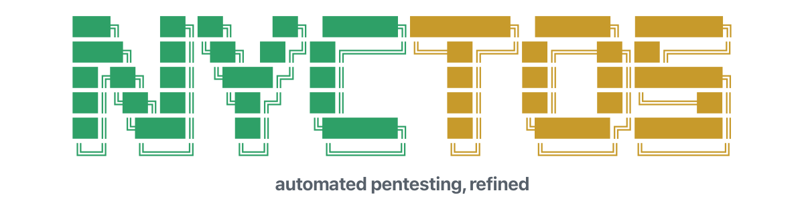
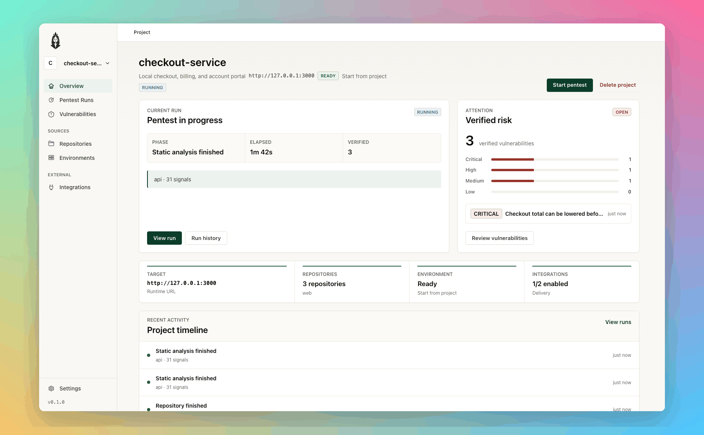
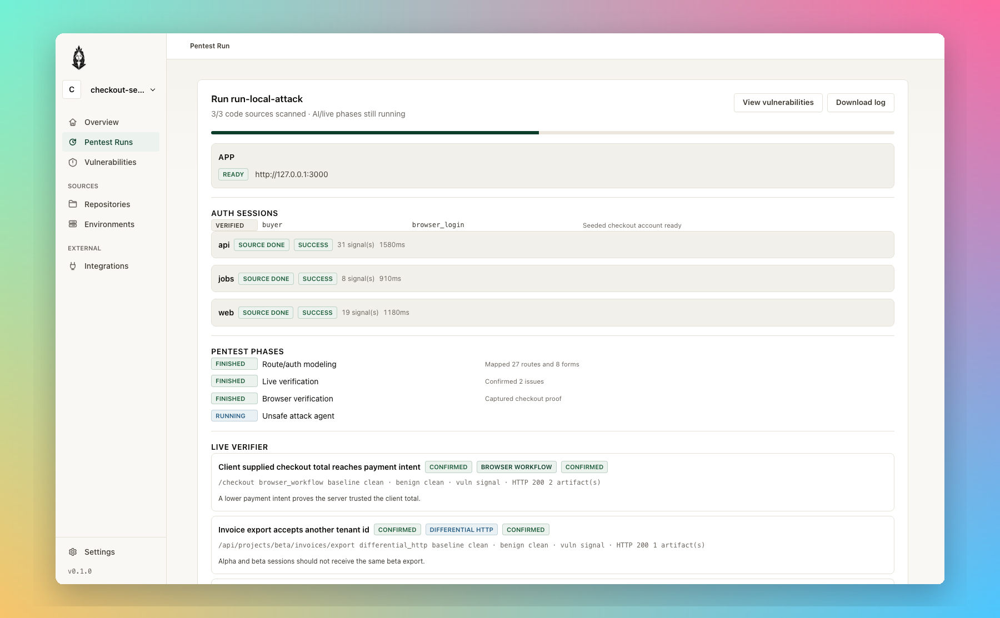
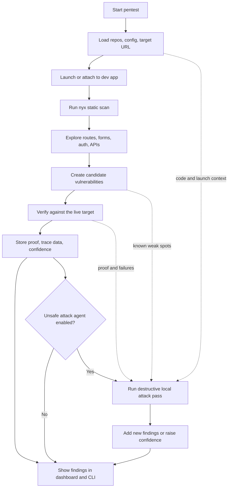
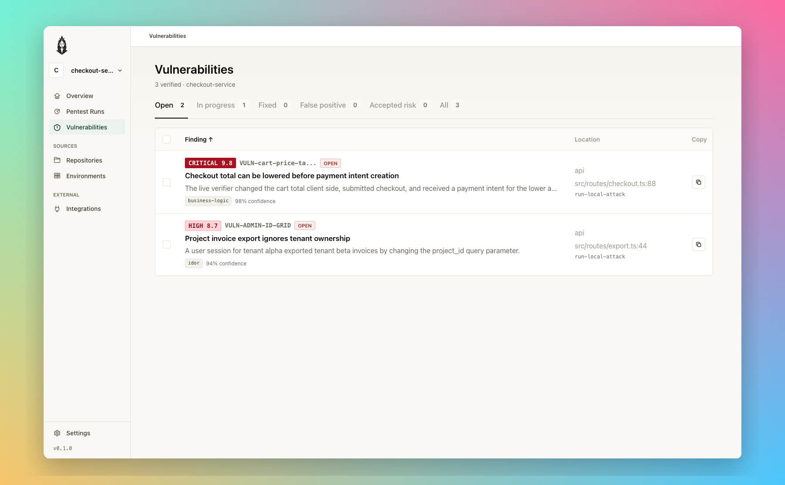
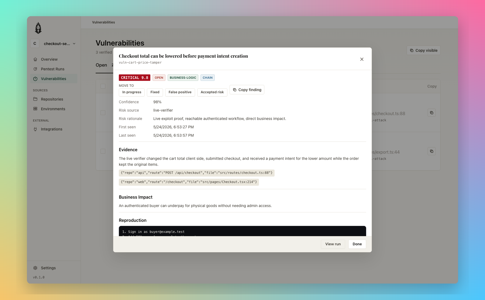

<div align="center">
  

**Run a live pentest against a dev app you control. Nyctos reads the repo, drives the local target, verifies findings, and gives you proof instead of a guess list.**

  <p>
    <a href="LICENSE.md"></a>
    <a href="https://www.rust-lang.org/"></a>
    <a href="https://pnpm.io/"></a>
    <a href="https://github.com/nyx-sec/nyx"></a>
  </p>
</div>

<p align="center"></p>

---

## Pentest locally, prove locally

Nyctos is the product layer around `nyx` for live, local pentesting. Point it at a repo and a dev URL. It launches or watches the app, reads the code, maps routes, sends scoped probes, and only promotes findings when it can attach evidence.

The dashboard is built for the part that usually gets messy: deciding what is real, what already has proof, and what still needs a harder look.

```bash
cargo run --bin nyctos -- scan ./apps/web --target-url http://127.0.0.1:3000
cargo run --bin nyctos -- serve
```

The target stays local. The API binds to loopback by default. The run history, traces, evidence, and triage state live in the Nyctos product store.

<p align="center"></p>

## What a run does

| Stage | What happens |
|---|---|
| **Scope** | Load project repos, target URLs, launch profile, previous findings, and runtime settings. |
| **Static scan** | Run `nyx` over the source tree and normalize the scanner output. |
| **Explore** | Build route, form, auth, and API context from the app and codebase. |
| **Candidate pass** | Turn scanner findings and runtime signals into concrete issues worth checking. |
| **Verification** | Send targeted live checks to the dev app and collect request, response, and trace proof. |
| **Triage** | Store verified vulnerabilities with confidence, status, evidence, and run attribution. |
| **Attack pass** | Optional destructive local pass that tries to break the app after the rest of the context is known. |

<p align="center"></p>

## How the live pentest fits together



The unsafe attack agent runs last because it should not waste time guessing from a blank page. By the time it starts, Nyctos has code context, target context, previous candidates, existing vulnerabilities, and live verification signals. If it breaks something new, the result is recorded as a vulnerability candidate or used to raise confidence on an existing one.

This mode is meant for disposable local state. It can mutate data, create accounts, submit payloads, corrupt fixtures, or knock the dev app over. That is the point.

## CLI first, dashboard when it matters

Use the CLI for one-off runs, CI smoke checks, and local scripts:

```bash
nyctos doctor
nyctos scan ./apps/web
nyctos scan ./apps/web --target-url http://127.0.0.1:3000
nyctos scan ./apps/web --exploit
nyctos scan ./apps/web --unsafe-attack-agent
nyctos serve
nyctos pr-comment --run-id <id>
```

Use the dashboard when you want to watch a live run, inspect proof, update triage, or keep project setup in one place.

<p align="center"></p>

<p align="center"></p>

## Local app setup

A launch profile tells Nyctos how to start the target and where to probe it:

```toml
[project]
name = "checkout-service"
root = "/Users/you/dev/checkout-service"

[project.launch]
command = "npm run dev"
cwd = "/Users/you/dev/checkout-service"
target_url = "http://127.0.0.1:3000"
health_url = "http://127.0.0.1:3000/health"
startup_timeout_secs = 45
```

For live testing, use `127.0.0.1`, `localhost`, or another dev host you control. Use seeded accounts and throwaway databases for destructive runs.

## Install from source

Nyctos is pre-MVP. The core loop works, but packaging is still moving.

```bash
cargo build --workspace
cargo run --bin nyctos -- doctor
cargo run --bin nyctos-api
npm --prefix frontend install
npm --prefix frontend run dev
```

Useful checks while working on the repo:

```bash
cargo fmt --all
cargo clippy --workspace --all-targets -- -D warnings
cargo test --workspace
npm --prefix frontend run check
```

## Docs

- [Configuration](docs/config.md)
- [CLI](docs/cli.md)
- [API](docs/api.md)
- [Product store](docs/product-store.md)
- [SQLx setup](docs/dev/sqlx.md)

## License

Nyctos is source-available under PolyForm Small Business License 1.0.0. See [LICENSE.md](LICENSE.md). The upstream `nyx` scanner is a separate GPL-3.0-or-later project.
