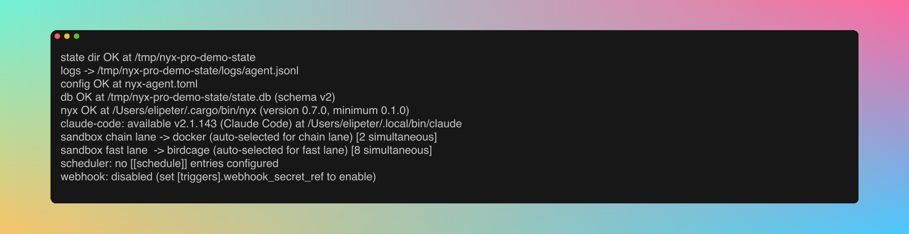
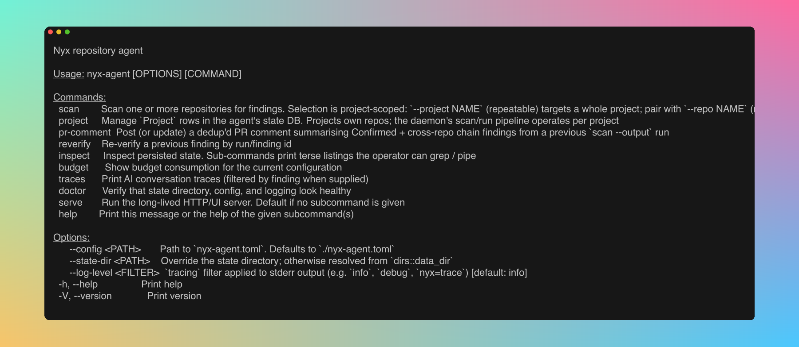
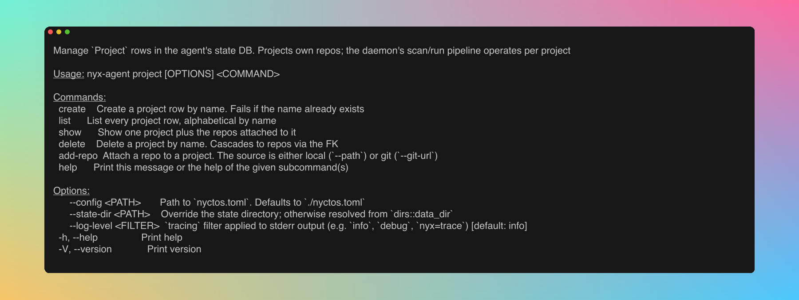

<!-- nyx: verbatim -->
<div align="center">
  

[](#status)
[](#naming)
[](LICENSE.md)
[](docs/SUMMARY.md)
</div>

---

Nyctos is a self-hosted security analysis daemon that wraps the `nyx`
scanner with an AI-driven exploit-synthesis layer and a full-environment
sandbox. It runs continuously across your repositories, validates
findings inside an isolated dev environment, and emits reproducible
evidence for every exploitable finding.

The shipping binary is `nyx-agent`; the rename to `nyctos` is queued
as its own phase (see Naming below).
<!-- /nyx: verbatim -->

## Status

Pre-MVP. The daemon is functional end-to-end against the upstream
`nyx` scanner. The end-to-end demo fixture, MVP polish, and
closed-beta packaging phases come next, before the first tag.

What ships today:

- `nyx` subprocess driver with parallel run aggregation and a
  SQLite-backed state store.
- Axum HTTP + WebSocket API, auth-token gated, loopback bind by
  default.
- Embedded SPA: first-launch wizard, project + repo manager,
  findings browser, live scan view, quarantine, AI trace viewer.
- Two AI runtime adapters, Anthropic SDK and Claude Code, wired to
  four tasks: payload synthesis, spec derivation, chain reasoning,
  novel finding discovery.
- Two sandbox lanes: birdcage (in-process seccomp on Linux) and a
  chain lane that auto-selects libkrun, Firecracker, or Docker.
- Env-builder docker-compose spinup, cross-repo chain runner, and
  reproducible-evidence bundles for every confirmed finding.
- Scan triggers: CLI, cron, webhook, plus a GitHub Actions
  composite for PR gating.

The daemon UI is a loopback-bound SPA. The project detail page is
the operator's main work surface: project metadata, target base
URL, and the attached repos with their scan status, last scan
timestamp, and per-row "Scan now" + "Remove" actions:


`nyx-agent doctor` prints the runtime probes the daemon uses at
startup:



## Documentation

Operator-facing docs live under [`docs/`](docs/); the
[`docs/SUMMARY.md`](docs/SUMMARY.md) index lists every page. Start
here:

- [`docs/install.md`](docs/install.md): prerequisites, source build,
  and `nyx-agent doctor`.
- [`docs/quickstart.md`](docs/quickstart.md): first daemon, first
  project, first scan, first findings.
- [`docs/triggers/cron.md`](docs/triggers/cron.md) and
  [`docs/triggers/webhook.md`](docs/triggers/webhook.md): no-touch
  scan triggers.
- [`docs/ci/github-actions.md`](docs/ci/github-actions.md): the
  shipped composite Action for PR gating.

### Quickstart in three commands

Repos in Nyctos are always nested under a `Project`. A fresh
install reaches a first scan in three steps:

```bash
nyx-agent project create acme-app --target-base-url http://localhost:3000
nyx-agent project add-repo acme-app acme-backend --path /abs/path/backend --i-own-this
nyx-agent scan --project acme-app
```

`nyx-agent --help` shows the rest of the surface (scan, project,
pr-comment, reverify, inspect, budget, traces, doctor, serve) plus
the top-level flags every subcommand inherits:



The `project` subcommand the quickstart leads with is the entry
point for the Project / repo model: `create`, `list`, `show`,
`delete`, `add-repo`.



See [`docs/quickstart.md`](docs/quickstart.md) for the worked
walkthrough (wizard, TOML form, HTTP form, output shape) and
[`docs/cli.md#project`](docs/cli.md) for the full `project`
subcommand reference.

## Upstream `nyx` scanner

`nyx-agent` shells out to the upstream `nyx` static scanner; the agent has
no FFI link against it. The `nyx` binary must be installed and discoverable:

- by default on `PATH` (verify with `which nyx`), or
- via `[nyx].binary_path = "/abs/path/to/nyx"` in `nyctos.toml`.

`nyx-agent doctor` reports the resolved path, the detected version, and the
minimum supported version. It exits non-zero when the binary is missing or
below the minimum.

## Licensing

Nyctos is **source-available** software, distributed under the PolyForm
Small Business License 1.0.0. The PolyForm license is not OSI-approved,
so Nyctos is not OSS. Do not describe it as such in public
communication.

- Free for personal use, research, hobby projects, OSS contribution, and
  any organisation that qualifies as a Small Business under the license
  (fewer than 100 staff and less than $1,000,000 USD annual revenue).
- A commercial license is required for organisations above that
  threshold. See `LICENSE.md` for the verbatim license text and contact
  details.

The upstream `nyx` core scanner is a separate project under
GPL-3.0-or-later. That GPL-licensed scanner is the OSS component of the
stack; the `nyx-agent` daemon in this repository is not.

## Naming

**Nyctos** (Greek genitive of `Nyx`, "of-the-night") is the product
brand. The shipping crates, binary (`nyx-agent`), config
(`nyctos.toml`), and state directory (`~/.local/share/nyctos/`)
still carry their legacy names; the code rename to `nyctos` is queued
as its own phase. The upstream dynamic-verification engine `nyx`
(GPL-3.0-or-later) keeps its name. Full target surface at
`.pitboss/nyctos-spec.md`.

## Contributing

Contributor-facing notes for working on the daemon itself live under
[`docs/dev/`](docs/dev/):

- [`docs/dev/sqlx.md`](docs/dev/sqlx.md): regenerating the SQLx
  prepared-query cache after a `query!` change.
- [`docs/dev/frontend.md`](docs/dev/frontend.md): release vs debug
  SPA embedding, plus the two-terminal Vite dev loop.
