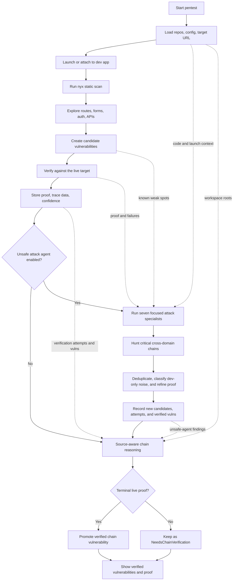

<div align="center">
  

**Run a live pentest against a dev app you control. Nyx Agent reads the repo, drives the local target, verifies findings, and gives you proof instead of a guess list.**

  <p>
    <a href="LICENSE.md"></a>
    <a href="https://www.rust-lang.org/"></a>
    <a href="https://pnpm.io/"></a>
    <a href="https://github.com/nyx-sec/nyx"></a>
  </p>
</div>

<p align="center"></p>

---

## Pentest locally, prove locally

Nyx Agent is the product layer around `nyx` for live, local pentesting. Point it at a repo and a dev URL. It launches or watches the app, reads the code, maps routes, sends scoped probes, and only promotes findings when it can attach evidence.

The dashboard is built for the part that usually gets messy: deciding what is real, what already has proof, and what still needs a harder look.

```bash
nyx-agent scan ./apps/web --target-url http://127.0.0.1:3000
nyx-agent serve
```

The target stays local. The API binds to loopback by default. The run history, traces, evidence, and triage state live in the Nyx Agent product store.

<p align="center"></p>

## What a run does

| Stage | What happens |
|---|---|
| **Scope** | Load project repos, target URLs, launch profile, previous findings, and runtime settings. |
| **Static scan** | Run `nyx` over the source tree and normalize the scanner output. |
| **Explore** | Build route, form, auth, and API context from the app and codebase. |
| **Candidate pass** | Turn scanner findings and runtime signals into concrete issues worth checking. |
| **Verification** | Send targeted live checks to the dev app and collect request, response, and trace proof. |
| **Attack pass** | Optional destructive local phase that runs focused specialists, a cross-domain chain hunter, and final attack triage against the dev app. |
| **Chain reasoning** | Let the chain agent inspect graph evidence and, when an optional provider-authorized CLI runtime is configured, read/search repo code to connect low-level leads into higher-impact paths. |
| **Triage** | Store verified vulnerabilities with confidence, status, evidence, and run attribution. |

<p align="center"></p>

## How the live pentest fits together



The unsafe attack phase runs late because it should not waste time guessing from a blank page. By the time it starts, Nyx Agent has code context, target context, previous candidates, existing vulnerabilities, and live verification signals. It runs serially so each pass can inherit newly recorded findings:

| Pass | Focus |
|---|---|
| Business logic | Workflow and state-machine abuse, role transitions, invites, quotas, lifecycle edges, and order-of-operation bugs. |
| Payments and billing | Checkout, subscriptions, invoices, coupons, trials, webhooks, refunds, entitlement enforcement, and payment-status trust. |
| User data and privacy | IDORs, cross-tenant data access, exports, imports, files, logs, analytics payloads, and deleted-user remnants. |
| Auth and session | Login, reset flows, OAuth, magic links, MFA, cookies, CSRF, session lifetime, account linking, and privilege escalation. |
| API and input handling | Mass assignment, validation gaps, hidden fields, file uploads, parser confusion, SSRF-like fetches, injection, and deserialization. |
| Infra and dev/prod drift | Secrets, env config, debug routes, dev mailers, seed credentials, logs, local services, admin tooling, CORS, and deployment assumptions. |
| Abuse and automation | Rate limits, brute force, enumeration, scraping, invite/email/SMS abuse, queue flooding, resource exhaustion, and free-tier abuse. |
| Critical chain hunter | Cross-domain paths that combine smaller primitives into account takeover, cross-tenant compromise, payment bypass, persistent admin access, or secret exposure. |
| Attack triage | Deduplicate, classify dev-only noise, confirm material upgrades, and record only issues supported by live proof. |

Each pass is told it is operating in a development environment. Dev mailers, mock payment providers, localhost-only callbacks, seed credentials, debug routes, and synthetic fixtures are not production findings by themselves. They only become findings when the source, config, routing, or live behavior shows a production-relevant trust boundary or a real local-secret risk.

Chain reasoning runs after that. It sees the normalized attack graph: static signals, candidates, routes, roles, objects, authz observations, verification attempts, verified vulnerabilities, and unsafe-agent results. When the selected runtime supports agent loops, the chain worker also receives repo workspace roots and can read/search source before returning chain JSON. Chains that terminate in live proof are promoted as verified chain vulnerabilities; chains without terminal proof stay as `NeedsChainVerification`.

This mode is meant for disposable local state. It can mutate data, create accounts, submit payloads, corrupt fixtures, or knock the dev app over. That is the point.

## CLI first, dashboard when it matters

Use the CLI for one-off runs, CI smoke checks, and local scripts:

```bash
nyx-agent doctor
nyx-agent scan ./apps/web
nyx-agent scan ./apps/web --target-url http://127.0.0.1:3000
nyx-agent scan ./apps/web --exploit
nyx-agent scan ./apps/web --unsafe-attack-agent
nyx-agent serve
nyx-agent pr-comment --run-id <id>
```

Use the dashboard when you want to watch a live run, inspect proof, update triage, or keep project setup in one place.

<p align="center"></p>

<p align="center"></p>

## Local app setup

A launch profile tells Nyx Agent how to start the target and where to probe it:

```toml
[project]
name = "checkout-service"
root = "/Users/you/dev/checkout-service"

[project.launch]
command = "npm run dev"
cwd = "/Users/you/dev/checkout-service"
target_url = "http://127.0.0.1:3000"
health_url = "http://127.0.0.1:3000/health"
startup_timeout_secs = 45
```

For live testing, use `127.0.0.1`, `localhost`, or another dev host you control. Use seeded accounts and throwaway databases for destructive runs.

## Install

Install the released CLI and daemon from crates.io:

```bash
cargo install nyx-agent
nyx-agent doctor
nyx-agent serve
```

The crates.io package includes the prebuilt dashboard assets, so users do not
need Node or pnpm to install Nyx Agent. You still need the separate `nyx`
static scanner on `PATH` or configured with `[nyx].binary_path`.

For development from a repository checkout:

```bash
cargo build --workspace
cargo run --bin nyx-agent -- doctor
pnpm --dir frontend install
pnpm --dir frontend run dev
```

Useful checks while working on the repo:

```bash
cargo fmt --all
cargo clippy --workspace --all-targets -- -D warnings
cargo test --workspace
npm --prefix frontend run check
```

## Docs

- [Configuration](docs/config.md)
- [CLI](docs/cli.md)
- [API](docs/api.md)
- [Product store](docs/product-store.md)
- [SQLx setup](docs/dev/sqlx.md)

## Support and Commercial Use

Nyx Agent is free and open source under AGPLv3-or-later. Commercial licenses,
paid support, onboarding help, private policy packs, and enterprise terms are
available for teams that need proprietary embedding, hosted resale, custom
support obligations, or license comfort. See [LICENSE.md](LICENSE.md) or contact
<licensing@nyx.dev>.

Nyx Agent does not include or resell model access. AI runtimes are optional
BYOK/local connectors; users are responsible for complying with the terms for
their chosen API provider, local endpoint, or installed CLI.

## License

Nyx Agent is open source under AGPLv3-or-later. See [LICENSE.md](LICENSE.md).
Contributions are accepted under the [Nyx Agent Contributor License
Agreement](CLA.md) so the project can remain open while commercial licenses are
available for organizations that need them. The upstream `nyx` scanner is a
separate GPL-3.0-or-later project.
